<p align="center">
  
</p>

## 👋 Hello world!

<div align="center">
  
</div>

  

<details>
  <summary><strong>Profile JSON</strong></summary>

```json
{
  "name": "Gianluca Squarcia",
  "role": "Software Engineer",
  "location": "Rome, Italy",
  "employer": "Enel",
  "interests": [
    "Python",
    "automation",
    "agentic workflows",
    "data-driven decision software"
  ],
  "github": "https://github.com/gianlucasquarcia",
  "linkedin": "https://www.linkedin.com/in/gianluca-squarcia-5590b543/"
}
```

</details>

## 📫 About Me

> Software engineer at **Enel** in Rome 🇮🇹. I turn ideas into reliable, automated software.

| | Area | What that means |
|:-:|---|---|
| 🐍 | **Python & Backend** | Async APIs, typed models, and services that keep running |
| 🤖 | **AI / LLM Systems** | Tool-calling models, agents, and human-in-the-loop flows |
| ⚙️ | **Automation** | Small utilities that remove everyday friction |
| 📈 | **Trading Tech** | Signal engines, paper trading, and live dashboards |
| 📊 | **Decision Software** | Turning raw data into clear, actionable outcomes |

## 💻 Featured Projects

<p align="center"><sub>A few highlights from a broader portfolio of projects and experiments.</sub></p>

<table align="center">
  <tr>
    <td valign="top" width="50%">
      <h3>📈 <a href="https://github.com/gianlucasquarcia/ConsensusTrading">ConsensusTrading</a></h3>
      <p>A multi-agent swing-trading system: <b>11 strategy agents</b> vote, and a trade happens only if all 11 agree. Includes a live WebSocket dashboard.</p>
      
      
      
    </td>
    <td valign="top" width="50%">
      <h3>🪙 <a href="https://github.com/gianlucasquarcia/Cryptobot">Cryptobot</a></h3>
      <p>A set-and-forget crypto bot that trades <b>20/50 EMA crossovers</b>. It saves its state across restarts and has a live trading-terminal dashboard.</p>
      
      
      
    </td>
  </tr>
  <tr>
    <td valign="top" width="50%">
      <h3>🧠 <a href="https://github.com/gianlucasquarcia/LLM_functions_calling">LLM_functions_calling</a></h3>
      <p>An autonomous agent that breaks goals into steps, calls tools, pauses for <b>human approval</b>, and resumes from checkpoints. Runs on Gemini or local Ollama.</p>
      
      
      
    </td>
    <td valign="top" width="50%">
      <h3>🤫 <a href="https://github.com/gianlucasquarcia/STFU">STFU</a></h3>
      <p>Automatically mutes <b>Spotify ads</b> and unmutes when the music comes back. It mutes only Spotify, never the system volume. Works on Windows and Linux.</p>
      
      
      
    </td>
  </tr>
</table>

## 🧠 What I Like to Build

<table align="center">
  <tr>
    <td align="center" width="50%">
      <h3>🤖 Agentic Workflows</h3>
      <sub>Autonomous agents that plan, pick tools and ask a human before risky actions.</sub>
    </td>
    <td align="center" width="50%">
      <h3>⚡ Backend APIs</h3>
      <sub>Fast, typed async services with live data sent over WebSockets.</sub>
    </td>
  </tr>
  <tr>
    <td align="center" width="50%">
      <h3>🧠 Practical AI</h3>
      <sub>LLM features with function calling that solve real problems, not just demos.</sub>
    </td>
    <td align="center" width="50%">
      <h3>🧪 Clean Engineering</h3>
      <sub>Testable, linted, well-structured code that stays easy to maintain.</sub>
    </td>
  </tr>
</table>

<p align="center"><i>"I will always choose a lazy person for a difficult job. Because, he will find an easy way to do it. (Bill Gates)"</i></p>

## 🛠️ Tech Stack


## 🌐 Connect

<p>
  <a href="https://github.com/gianlucasquarcia"></a>
  <a href="https://www.linkedin.com/in/gianluca-squarcia-5590b543/"></a>
  <a href="https://x.com/gianjisq"></a>
</p>

<p><sub>⭐ Explore my repositories to see what I'm building right now.</sub></p>
